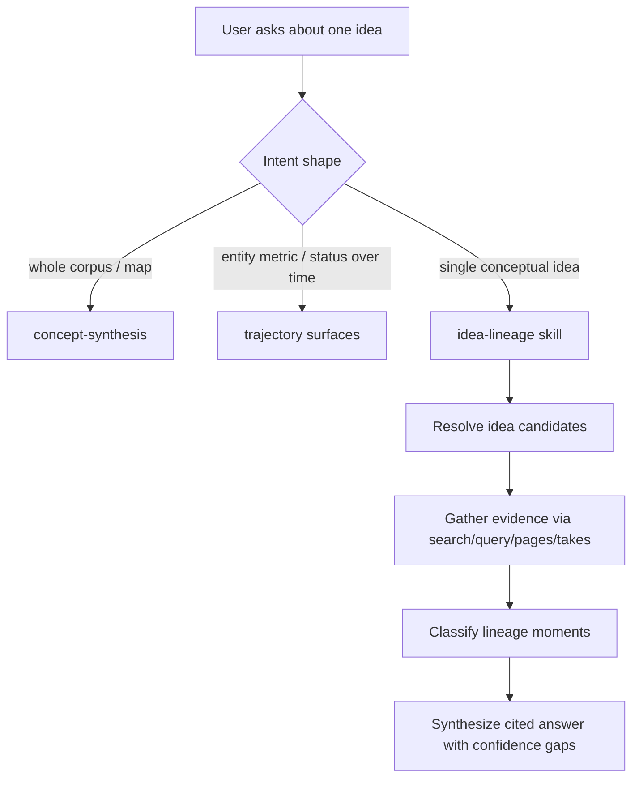

# feat: Add idea-lineage thinking skill

## Summary

Add an `idea-lineage` thinking skill that traces how one idea has evolved through a user's brain: first mention, best articulation, related concepts, reversals, contradictions, abandoned branches, and the current live version. The contribution should start as a read-only skill with routing and conformance coverage, not as a new CLI or MCP operation.

## Problem Frame

GBrain already has two adjacent capabilities that are easy to conflate with this feature:

- `skills/concept-synthesis/SKILL.md` is a mutating, batch-oriented concept map builder. It deduplicates many concept stubs, tiers them, writes concept pages, and creates an intellectual universe.
- `find_trajectory` and `gbrain eval trajectory` are structured entity trajectories over typed facts and events. They work best for questions like metric history, founder consistency, role/status changes, and event timelines.

`idea-lineage` should occupy the narrow space between them: a query-time, single-idea, citation-backed synthesis of conceptual evolution. It should help a user ask "how has my thinking about this idea changed?" without running a global concept-synthesis job or forcing the idea into an entity/metric trajectory model.

## Requirements

**Behavior**

- R1. The skill accepts a single idea, topic, concept phrase, or nearby concept page and produces a focused lineage for that idea only.
- R2. The output identifies first mention, best articulation, related concepts, reversals, contradictions, abandoned branches, and current live version when evidence supports each category.
- R3. Every lineage claim is grounded in existing brain evidence: page links, dates, verbatim snippets, timeline entries, takes, contradiction findings, or trajectory points when applicable.
- R4. The skill distinguishes evidence strength. Missing or weak evidence should be reported as a gap, not filled with plausible narrative.
- R5. The default workflow is read-only and does not write or mutate brain pages.

**Routing**

- R6. Routing should prefer `idea-lineage` for single-idea evolution requests such as "how has my thinking about X changed?".
- R7. Routing should keep broad corpus/map requests on `concept-synthesis`.
- R8. Routing should keep structured entity metric/status questions on `find_trajectory`, `gbrain eval trajectory`, or `gbrain think` trajectory injection.

**Privacy and portability**

- R9. The skill and fixtures must use public, generic examples only.
- R10. The plan and implementation must avoid private fork names, real people, real companies, funds, or host-specific filesystem paths in public artifacts.

## Scope Boundaries

### In Scope

- A new bundled skill under `skills/idea-lineage/`.
- Resolver, manifest, and plugin-bundle wiring.
- Routing fixtures that prove the new intent is reachable and does not swallow `concept-synthesis` or trajectory-shaped prompts.
- Documentation inside the skill body that explains when to use `search`, `query`, `get_page`, `list_pages`, `takes_search`, `find_contradictions`, and optionally `find_trajectory`.
- Focused conformance, resolver, and routing verification.

### Deferred to Follow-Up Work

- A first-class `idea_lineage` MCP operation.
- A `gbrain idea lineage <query>` CLI.
- Persisting lineage reports back into the brain.
- New database tables, schema-pack fields, or concept lineage graph primitives.
- Automated contradiction-probe reruns. The skill should read cached contradiction findings if available, not trigger expensive probes.

### Outside This Contribution

- Replacing `concept-synthesis`.
- Changing the facts/takes epistemology model.
- Changing `find_trajectory`'s entity-slug contract.
- Implementing the broader taxonomy redesign tracked by issue #1668.

## Key Technical Decisions

- **Start as a markdown skill:** GBrain's architecture treats skills as fat markdown workflows. This feature can be useful by orchestrating existing read operations, so a CLI/MCP surface would add contract weight before the behavior is proven.
- **Make the skill non-mutating by default:** The user intent is investigative. Writing lineage pages should remain a later explicit mode after routing and output quality are established.
- **Use evidence buckets rather than a single narrative pass:** The output should force the agent to separately evaluate first mention, articulation, current version, reversals, contradictions, and abandoned branches. That reduces the risk of smoothing over conflict.
- **Keep `find_trajectory` as an optional side-channel:** It is valuable when an idea query resolves to an entity attribute or status history, but `idea-lineage` should not depend on typed facts being present.
- **Avoid the existing "trace idea evolution" trigger phrase:** That phrase already routes to `concept-synthesis`; adding it to the new skill would create avoidable resolver ambiguity.

## High-Level Technical Design

## Implementation Units

### U1. Add the `idea-lineage` Skill

- **Goal:** Create the read-only skill contract and workflow.
- **Requirements:** R1, R2, R3, R4, R5, R9, R10
- **Dependencies:** None
- **Files:**
  - `skills/idea-lineage/SKILL.md`
  - `test/skills-conformance.test.ts`
- **Approach:** Create a new skill with required frontmatter and conformance sections. The skill should define its workflow in phases: clarify the target idea, resolve likely concept/page anchors, collect evidence, classify lineage moments, produce a cited synthesis, and state gaps. Frontmatter should set `mutating: false` and list read operations only.
- **Patterns to follow:**
  - `skills/strategic-reading/SKILL.md` for a read-only thinking-skill shape with related-skill boundaries.
  - `skills/query/SKILL.md` for search/query/get-page guidance.
  - `skills/concept-synthesis/SKILL.md` for contrast, not for behavior reuse.
- **Test scenarios:**
  - A new `SKILL.md` with frontmatter, `## Contract`, `## Output Format`, and `## Anti-Patterns` passes conformance.
  - The frontmatter declares a unique `name: idea-lineage`.
  - The skill body references only portable, synthetic examples.
- **Verification:** `bun test test/skills-conformance.test.ts` passes.

### U2. Wire Resolver, Manifest, and Bundle Metadata

- **Goal:** Make the skill discoverable by bundled skill users and resolvable by agents.
- **Requirements:** R6, R7, R8, R9, R10
- **Dependencies:** U1
- **Files:**
  - `skills/RESOLVER.md`
  - `skills/manifest.json`
  - `openclaw.plugin.json`
  - `test/resolver.test.ts`
  - `test/skillpack-reference.test.ts`
- **Approach:** Add `idea-lineage` to the skill manifest and plugin skill list. Add a resolver row in the thinking or uncategorized section with narrow user phrases such as "how has my thinking about", "trace the lineage of this idea", "what is my current version of", and "show reversals in my thinking about". Keep broad concept-map phrases routed to `concept-synthesis`.
- **Patterns to follow:**
  - `skills/RESOLVER.md` rows for `strategic-reading`, `concept-synthesis`, and `perplexity-research`.
  - Existing sorted `openclaw.plugin.json` skill list.
- **Test scenarios:**
  - Every quoted resolver trigger fuzzy-matches a frontmatter trigger in `skills/idea-lineage/SKILL.md`.
  - `idea-lineage` is listed in `skills/manifest.json`.
  - `idea-lineage` is listed in `openclaw.plugin.json` if the contribution ships as part of the bundled OpenClaw skillpack.
  - Existing skills remain reachable.
- **Verification:** `bun test test/resolver.test.ts` passes.

### U3. Add Routing Eval Fixtures

- **Goal:** Prove the new routing boundary against adjacent skills.
- **Requirements:** R6, R7, R8
- **Dependencies:** U1, U2
- **Files:**
  - `skills/idea-lineage/routing-eval.jsonl`
  - `skills/concept-synthesis/routing-eval.jsonl`
  - `src/core/routing-eval.ts`
- **Approach:** Add positive fixtures for single-idea lineage prompts and negative or ambiguity-declared fixtures around adjacent surfaces. The fixture text should paraphrase triggers rather than copy them exactly, because the routing fixture linter rejects tautological trigger copies.
- **Test scenarios:**
  - "Show how my thinking about founder-led sales changed over time" routes to `idea-lineage`.
  - "What is my current version of the compounding trust idea?" routes to `idea-lineage`.
  - "Synthesize my concepts into a tiered intellectual map" stays on `concept-synthesis`.
  - "How has acme-example MRR trended since January?" does not route to `idea-lineage`.
  - Negative fixtures avoid false positives for generic "publish this report" or "what is this concept?" prompts.
- **Verification:** `gbrain routing-eval --json` reports no new misses, false positives, or unapproved ambiguity for the added fixtures.

### U4. Add Output Contract and Citation Discipline

- **Goal:** Make the skill's user-facing answer shape predictable and reviewable.
- **Requirements:** R2, R3, R4, R5
- **Dependencies:** U1
- **Files:**
  - `skills/idea-lineage/SKILL.md`
  - `skills/conventions/quality.md`
  - `skills/brain-ops/SKILL.md`
- **Approach:** Define the output format directly in the skill body. The recommended shape should include a compact current answer, evidence timeline, lineage buckets, contradictions/reversals, abandoned branches, related concepts, and confidence gaps. Require page/date/snippet evidence for each non-gap claim. Preserve quote fidelity and avoid hallucinated dates.
- **Patterns to follow:**
  - `skills/conventions/quality.md` for citation and quote-fidelity expectations.
  - `skills/brain-ops/SKILL.md` for source attribution and source-id formatting.
  - `docs/takes-vs-facts.md` for not conflating holder-attributed takes with the brain owner's facts.
- **Test scenarios:**
  - Test expectation: none beyond conformance for the markdown-only contract; routing and conformance tests cover the machine-checkable surface.
- **Verification:** Manual review confirms the skill body tells the agent how to cite, label gaps, and separate facts/takes/trajectory evidence.

### U5. Refresh Generated Documentation If Required

- **Goal:** Keep generated LLM-facing docs consistent if the test suite requires it.
- **Requirements:** R9, R10
- **Dependencies:** U1, U2, U3
- **Files:**
  - `llms.txt`
  - `llms-full.txt`
  - `test/build-llms.test.ts`
- **Approach:** Run the build-llms test after adding the skill. If it fails because committed docs are stale, regenerate with the existing generator and include the generated diff. If it passes without regeneration, leave these files unchanged.
- **Patterns to follow:**
  - `package.json` script `build:llms`.
  - `test/build-llms.test.ts` failure message.
- **Test scenarios:**
  - Committed `llms.txt` and `llms-full.txt` match generator output.
  - `llms-full.txt` remains within the size budget.
- **Verification:** `bun test test/build-llms.test.ts` passes.

## Acceptance Examples

- AE1. When the user asks "How has my thinking about founder-led sales changed over time?", the agent routes to `idea-lineage`, searches for evidence, and returns a cited lineage rather than running `concept-synthesis`.
- AE2. When the user asks "Run concept synthesis across my notes", the agent routes to `concept-synthesis`, not `idea-lineage`.
- AE3. When the user asks "How did acme-example's MRR trend?", the agent uses trajectory surfaces rather than `idea-lineage`.
- AE4. When the evidence does not support an "abandoned branch" claim, the output includes a gap instead of inventing one.

## Risks & Dependencies

- **Resolver overlap risk:** `concept-synthesis` already uses "trace idea evolution". Mitigate by avoiding that exact trigger and adding routing fixtures around the boundary.
- **Narrative overreach risk:** The feature invites story-making. Mitigate by requiring dates, snippets, links, and explicit gaps for unsupported categories.
- **Privacy risk:** Skill examples can easily drift into real-brain language. Use synthetic examples only and rely on existing privacy checks.
- **Generated-doc churn risk:** Adding a bundled skill may require `llms.txt` and `llms-full.txt` regeneration. Treat generated-doc changes as mechanical and separate from the skill design during review.
- **Future taxonomy dependency:** Issue #1668 may eventually change concept filing and identity. This plan avoids new schema assumptions so the contribution remains compatible with the current repo.

## Sources & Research

- `skills/concept-synthesis/SKILL.md` defines the existing batch, mutating, concept-map surface.
- `skills/RESOLVER.md` and `skills/manifest.json` define current skill reachability and bundle metadata.
- `docs/architecture/lens-packs.md` shows that atoms and concepts are already part of the lens-pack/dream-cycle substrate.
- `docs/proposals/temporal-contradiction-probe.md` and `docs/takes-vs-facts.md` define the temporal and epistemic boundaries this skill must not blur.
- `src/core/operations.ts`, `src/core/trajectory.ts`, `src/commands/eval-trajectory.ts`, and `test/operations-find-trajectory.test.ts` define the current `find_trajectory` contract.
- Pull requests #1131, #1296, and #1364 provide the recent trajectory, think-routing, and lens-pack context.
- Issue #1668 is related future taxonomy work, but not a prerequisite for this contribution.
